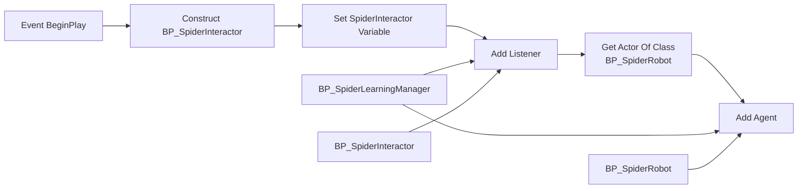
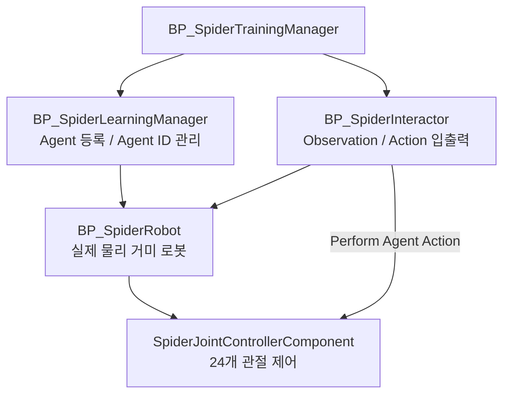




# 1. 소개


  이전 단계에서는 `BP_SpiderInteractor`에서 학습기가 출력한 24개의 Continuous Action 값을 가져와 `SpiderJointControllerComponent`의 `ApplyJointActions` 함수로 전달하는 구조까지 구현했으니, 이번 단계에서는 지금까지 구성한 **Learning Agents 입출력 구조**를 실제 학습 루프에 연결하기 위한 기반 작업을 진행해보도록 하자

- 현재까지 구성된 흐름은 다음과 같다.

```text
Learning Agents Action[24]
→ BP_SpiderInteractor.Perform Agent Action
→ Get Continuous Action
→ SpiderJointControllerComponent.ApplyJointActions
→ 24개 Physics Constraint 목표 회전 갱신
```

- 또한 `DA_SpiderJointConfig`를 통해 24개 관절 Constraint 설정을 별도 Data Asset으로 분리했고, 실행 로그를 통해 모든 Constraint가 정상적으로 초기화되는 것도 확인했다.

```text
Configs=24
ResolvedConstraints=24
Source=DataAsset
```

- 따라서 이제 다음 목표는 `BP_SpiderTrainingManager`에서 `BP_SpiderInteractor`를 실제 Learning Agents Manager에 연결하여, Interactor의 함수들이 학습 루프 안에서 호출될 수 있도록 만드는 것이다.
- 이번 단계에서 다룰 내용은 다음과 같다

```c++
1. BP_SpiderTrainingManager에서 Interactor 생성/등록
2. BP_SpiderInteractor가 실제 학습 루프에 연결되는지 확인
3. 이후 Observation 구조 정의로 넘어가기 위한 준비
```


정리하면, 지금까지는 **Action을 로봇 관절로 전달하는 통로**를 만들었다면, 이번 단계부터는 그 통로를 Learning Agents의 실제 학습 실행 구조에 연결하는 작업이다.


# 2. 작업


{}

### 소개

- 먼저 `BP_SpiderTrainingManager` 블루프린트를 열고 현재 구성된 Learning Agents 관련 컴포넌트와 BeginPlay 흐름을 확인한다.

```text
BP_SpiderLearningManager
BP_SpiderInteractor
BP_SpiderRobot
```

- 여기서 `Manager`는 학습 대상 Agent를 등록하고 관리하는 중심 역할을 하며, `Interactor`는 Agent와 Learning Agents 학습 루프 사이에서 Observation과 Action을 주고받는 입출력 인터페이스 역할을 한다.

{}

- 열어서, 블루프린트 그래프를 확인해보면, 이런 상태다.


- `BP_SpiderLearningManager`

```text
Agent 등록
Agent ID 관리
Interactor / Policy / Trainer와 연결되는 중심 역할
```

- `Get Actor Of Class`

이 노드는 월드에서 특정 클래스의 Actor를 하나 찾아오는 노드


```text
Actor Class = BP_SpiderRobot
```


그래서 월드에 배치된 거미 로봇 하나를 찾아서 Return Value로 넘긴다. 다만 주의할 점이, Get Actor Of Class는 해당 클래스의 Actor가 여러 개 있을 경우 그중 하나만 반환한다. 그래서 나중에 여러 마리 학습시키려면 이 방식은 추후에 수정해야 한다. 하지만 지금처럼 **로봇 한 마리로 연결 테스트**하는 단계이기 때문에 일단 그대로 두기로 한다

- `Add Agent`

이 노드는 Learning Agents Manager에 학습 대상을 등록하는 노드. 즉, BP_SpiderRobot을 Learning Agents Agent로 등록한다는 뜻이다.


```text
Target = BP_SpiderLearningManager
Agent = Get Actor Of Class의 Return Value
```

{}

{}


{}

- 현재까지 `BP_SpiderInteractor` 안에는 학습기가 출력한 Action 값을 실제 거미 로봇의 관절 제어로 전달하는 흐름이 구현되어 있다.

```c++
BP_SpiderInteractor.Perform Agent Action

→ Get Continuous Action

→ SpiderJointControllerComponent.ApplyJointActions

→ 24개 Physics Constraint 목표 회전 갱신
```

- 즉, `BP_SpiderInteractor`는 다음 역할을 담당한다.

```text
학습기가 출력한 Action 값을 읽고,
해당 Agent ID에 대응되는 BP_SpiderRobot을 찾은 뒤,
SpiderJointControllerComponent에 Action 값을 전달한다.
```

- 하지만 `BP_SpiderInteractor` 블루프린트 클래스가 존재한다고 해서 `Perform Agent Action` 함수가 자동으로 호출되는 것은 아니고, Learning Agents 쪽에서 이 Interactor를 사용하도록 Manager에 등록해야 한다. 등록되지 않은 Interactor는 함수와 로직을 가지고 있더라도 학습 루프에서 호출되지 않는 고립된 객체가 되기 때문이다.
- 따라서 이번 단계의 핵심은
- BP_SpiderTrainingManager에서 BP_SpiderInteractor 인스턴스를 생성하고,
- 이를 BP_SpiderLearningManager에 Listener로 등록한다.
- 그래서 최종적으로 만들고자하는 구조는 다음과 같다

```c++
BP_SpiderTrainingManager
│
├─ BP_SpiderLearningManager
│   └─ BP_SpiderRobot을 Agent로 등록
│
├─ BP_SpiderInteractor
│   ├─ Action 구조 정의
│   ├─ Observation 구조 정의
│   └─ Perform Agent Action에서 관절 제어
│
├─ LearningAgentsPolicy
│   └─ Observation을 보고 Action 출력
│
└─ LearningAgentsTrainer
    └─ Reward를 기반으로 Policy 학습
```


현재 단계에서는 이 중에서 `BP_SpiderLearningManager`, `BP_SpiderInteractor`, `BP_SpiderRobot Agent 등록`까지 연결하는 것이 목표다.

{}


{}

- BP_SpiderInteractor는 BP_SpiderTrainingManager의 Components 패널에 직접 추가하는 Actor Component가 아니다.
- BP_SpiderInteractor는 Learning Agents Interactor를 부모로 하는 별도의 Blueprint 클래스이므로, 실행 시점에 사용할 Interactor 인스턴스를 생성해야 한다.
- 이를 위해 BP_SpiderTrainingManager에  BeginPlay에서 생성한 `BP_SpiderInteractor` 인스턴스를 저장하기 위한 참조 변수를 추가해야 한다


```c++
SpiderInteractor : BP_SpiderInteractor Object Reference
```

- BeginPlay에서는 다음 노드를 추가한 후 이렇게 설정해주자


- **Class = BP_SpiderInteractor**
- **Outer = self**
- 그 다음 생성된 `Return Value`를 `SpiderInteractor` 변수에 저장하자

```text
EventBeginPlay
→ Construct BPSpider Interactor
→Set SpiderInteractor
```

- 여기까지의 의미는 다음과 같다.
- BP_SpiderInteractor설계도를 기반으로
- 실행중 사용할 실제 Interactor 객체를 생성하고,
- 그 객체를SpiderInteractor 변수에 저장한다.

{}


{}

- 현재 구조에서 BP_SpiderInteractor 는 Learning Agents Manager의 Listener로 동작한다. 따라서 Add Listener 를 통해 Manager에게 이 Interactor를 사용하라고 알려주어야 한다
- `Set SpiderInteractor` 노드의 실행 핀 뒤에 `Add Listener` 노드를 추가한다. 그리고 `Add Listener`의 입력 핀을 다음과 같이 연결한다
- Target   =BP_SpiderLearningManager
Listener =SpiderInteractor


그리고 `Add Listener`의 입력 핀을 다음과 같이 연결한다.

- 이 연결의 의미는 다음과 같다.

```text
BP_SpiderLearningManager에 등록된 Agent들에 대해
BP_SpiderInteractor가 Observation/ Action 처리를 담당한다.
```


따라서 BeginPlay 흐름은 다음과 같이 구성한다.


```text
EventBeginPlay
→ Construct BPSpider Interactor
→Set SpiderInteractor
→Add Listener
-Target   =BP_SpiderLearningManager
-Listener =SpiderInteractor
```


이 단계가 완료되어야 `BP_SpiderInteractor` 내부의 `Get Agent` 노드가 Agent ID를 기준으로 실제 `BP_SpiderRobot`을 가져올 수 있다.

- `Add Listener` 오른쪽 흰색 실행 핀을 잡는다.
- 기존 `Get Actor Of Class` 왼쪽 흰색 실행 핀에 연결한다.
- 기존 `Get Actor Of Class → Add Agent` 연결은 그대로 둔다.

{}


{}

- 최종 BeginPlay 흐름은 다음과 같다







{}

