


# 1. 소개

- 이전 단계에서는 BP_SpiderTrainingManager에서 BP_SpiderInteractor를 생성하고, 이를 BP_SpiderLearningManager에 Listener로 등록한 뒤, BP_SpiderRobot을 Agent로 등록하는 구조까지 구성했다.
- 또한, 학습기가 출력한 24개의 Continuous Action 값을 BP_SpiderInteractor에서 읽고, SpiderJointControllerComponent.ApplyJointActions로 전달하여 24개 Physics Constraint의 목표 회전을 갱신하는 구조도 구현했다.
- 따라서, 지금까지는 학습기가 Action을 출력했을 때 그 Action을 로봇 관절에 전달하는 통로를 만든 상태라고 볼 수 있다.

이번 단계에서는 반대로, 로봇의 현재 상태를 학습기가 읽을 수 있도록 Observation 구조를 구현해보자


---


# 2. 작업 전

- 구현할 내용을 정리해보면 결국은, `**BP_SpiderInteractor**`** 안에서 Observation 입력 통로를 만드는 작업이다.**
- 이미 Action 쪽은 이렇게 되어 있었다

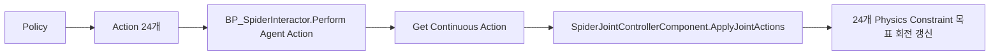

- 이번에는 반대로 이 흐름을 만들어 내면 된다.

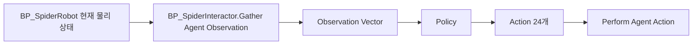


**거미 로봇 학습에 필요한 상태 정보를 정의하고, **`**BP_SpiderInteractor**`**에서 Observation 구조를 설계한 뒤, Policy가 사용할 입력 데이터 형태를 준비하는 것**이 목표다.


{}

- 구현 순서를 정리해 보면

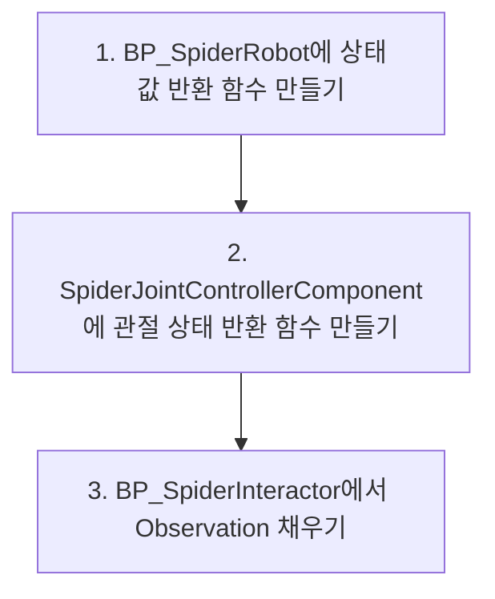


인데, 핵심은 `BP_SpiderInteractor`가 모든 값을 직접 계산하려고 하지 말고,

- **로봇 상태는 **`**BP_SpiderRobot**`**에서**,
- **관절 상태는 **`**SpiderJointControllerComponent**`**에서** 가져오게 만들어서 추후에 만약 다리 구조가 변경되더라도 구조를 덜 무너트리게 하는 것이다.

{}


---


{}

{}

- 우선적으로 몸체 상태 Observation 값을 반환하는 함수를 만들어야 한다
- 반환값은 물리값에 맞게 해당 데이터를 받도록 조정하자

```text
Pitch
Roll
Yaw
Height
ForwardVelocity
RightVelocity
AngularVelocityX
AngularVelocityY
AngularVelocityZ
```


즉, Body 쪽에서 총 8개를 입력 받아야 한다


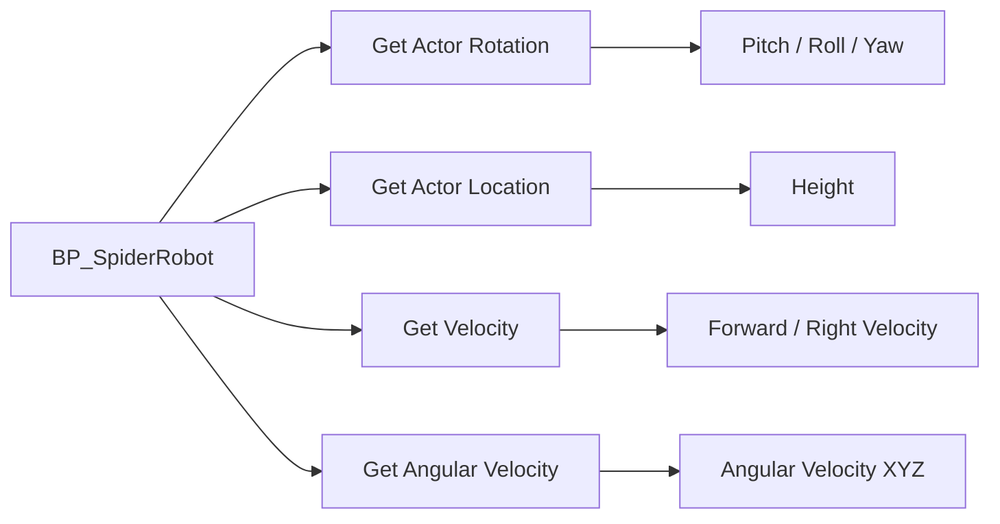

- 완성된 블루프린트에서의 모습


- 이제 이 8개 출력값에 실제 로봇 상태를 연결 해보도록 하자
- 그래프 빈 공간에서 우클릭해서 노드 추가(Get Actor Rotation)
- 그 다음 `Get Actor Rotation`의 Return Value에서 드래그해서(Break Rotator) 를 생성
- 각 항목을 연결


- 빈 공간 우클릭해서 노드 추가(Get Actor Location) → 그 다음 `Return Value` 파란 핀에서 드래그해서(Break Vector) 추가


- 빈 공간에서 우클릭 → 노드 생성(Get Velocity), 그리고 벡터 출력 노드 추가(Get Actor Forward Vector)
- `Get Velocity`의 Return Value에서 드래그해서 검색(Dot Product) 후 노드 생성

{}

- `Dot Product`는 한국어로 **내적.**
- ** 즉,속도 벡터가 어떤 방향으로 얼마나 향하고 있는지 계산하는 노드**
- 현재 `Get Velocity`는 로봇의 속도를 가져오지만, 이 값은 **월드 기준 속도**

예를 들면,


```text
월드 X 방향으로 120
월드 Y 방향으로 30
월드 Z 방향으로 0
```


하지만 우리가 알고 싶은 건 로봇의 기준에서의 값이기 때문에,


```text
로봇 기준 앞으로 얼마나 가는가?
로봇 기준 오른쪽으로 얼마나 밀리는가?
```


 `Dot Product`를 사용


{}

- 연결 구조


- 빈 공간 우클릭해서 검색(Get Actor Right Vector) 후 노드 추가
- 벡터 return 쪽에 Dot Product 추가
- 연결

```text
Get Velocity Return Value
→ 새 Dot Product 입력 1

Get Actor Right Vector Return Value
→ 새 Dot Product 입력 2

새 Dot Product 결과
→ Return Node의 Right Velocity
```

- 연결 구조


```text
Get Velocity ─────────────┬→ Dot Product 1 → Forward Velocity
Get Actor Forward Vector ─┘

Get Velocity ─────────────┬→ Dot Product 2 → Right Velocity
Get Actor Right Vector ───┘
```

- `Forward Velocity`는 앞으로 가는 속도,
- `Right Velocity`는 옆으로 미끄러지는 속도

를 구성한다.

- 이 값은 **몸체가 얼마나 회전하거나 흔들리는지**를 알려주는 값이다. 예를 들어 로봇이 넘어지려고 회전 중인지, 바닥에서 심하게 구르고 있는지 판단하는데 쓰인다.
- 하지만, 이걸 적용하기 전에 어떤 컴포넌트가 물리 몸체인지를 확인해야 한다. 즉, 실제 물리 시뮬레이션이 켜져 있는 Mesh Component에서 가져와야 한다는 뜻이다.
- 빈 공간에서 우클릭하고 검색(Get Physics Angular Velocity in Degrees)


`Spider Mesh`가 실제 물리 시뮬레이션을 담당하는 컴포넌트인 것을 확인할 수 있다

- `Get Physics Angular Velocity in Degrees`의 노란색 `Return Value` 핀에서 드래그해서 검색

```text
Break Vector
```

- 그 다음 이렇게 연결

```text
Break Vector X → Return Node의 Angular Velocity X
Break Vector Y → Return Node의 Angular Velocity Y
Break Vector Z → Return Node의 Angular Velocity Z
```

- 완성 구조

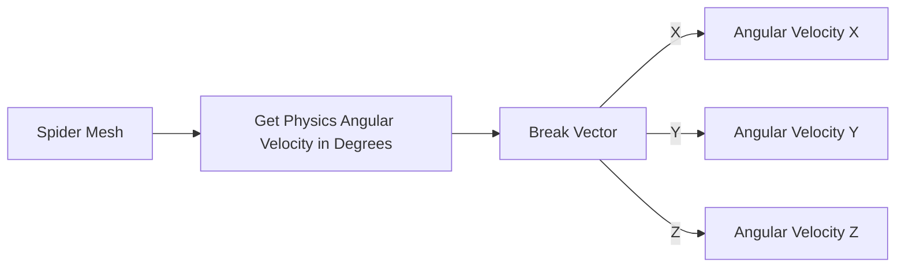


- 최종 구조


{}


{}

- `JointAngles`는 24개 관절의 현재 상태를 나타내고, `JointAngularVelocities`는 24개 관절의 각속도 상태를 나타낸다.
- 초기 구현에서는 Physics Constraint의 실제 현재각을 직접 읽기보다, `ApplyJointActions`에서 마지막으로 적용한 정규화 Action 값을 `LastJointTargetAngles`에 저장한 뒤 이를 관절 상태 Observation으로 사용한다.
- 즉, 현재 단계의 목적은 실제 관절 센서를 완벽하게 구현하는 것이 아니라, `BP_SpiderInteractor`가 관절 상태 배열을 읽어 Observation Vector에 포함할 수 있는 구조를 먼저 만드는 것이다.
1. 내부 코드에서

```c++
UFUNCTION(BlueprintPure, Category = "Spider Joint")
int32 GetControlledJointCount() const;
```


바로 아래에 아래 함수 추가


```c++
// Observation에서 사용할 관절 상태 값을 반환한다.
//
// 초기 구현에서는 실제 Physics Constraint의 현재 상대각을 직접 읽지 않고,
// ApplyJointActions에서 마지막으로 적용한 정규화 Action 값을 관절 목표 상태로 사용한다.
//
// JointAngles[i]와 JointAngularVelocities[i]는
// ActiveJointConfigs[i] / ResolvedConstraints[i]와 같은 순서를 따른다.
UFUNCTION(BlueprintPure, Category = "Spider Joint")
void GetJointObservationValues(
	TArray<float>& JointAngles,
	TArray<float>& JointAngularVelocities
) const;
```

1. 아래쪽 `private:` 영역에서 이 부분을 찾아서

```text
// ActiveJointConfigs와 같은 순서로 매칭되는 실제 Constraint 포인터 배열이다.
// Action[i]는 ResolvedConstraints[i]에 적용된다.
TArray<FConstraintInstance*>ResolvedConstraints;
```


그 아래에 이 변수 2개를 추가


```text
// Observation용으로 마지막에 적용한 관절 목표값을 저장한다.
// 현재는 실제 관절 각도가 아니라, -1.0 ~ +1.0으로 Clamp된 ActionValue를 저장한다.
UPROPERTY()
TArray<float>LastJointTargetAngles;

// Observation용 관절 각속도 값이다.
// 1차 구현에서는 0으로 유지하고, 이후 실제 관절 각속도 계산으로 확장한다.
UPROPERTY()
TArray<float>LastJointAngularVelocities;
```

1. InitializeControlledConstraints 수정

```c++
void USpiderJointControllerComponent::InitializeControlledConstraints()
{
ResolvedConstraints.Reset();
bLoggedActionCountMismatch =false;
```


여기에 배열 초기화를 추가


```c++
void USpiderJointControllerComponent::InitializeControlledConstraints()
{
ResolvedConstraints.Reset();
LastJointTargetAngles.Reset();
LastJointAngularVelocities.Reset();

bLoggedActionCountMismatch =false;
```

1. 그다음 `ActiveJointConfigs`가 비어 있는지 검사한 뒤, 즉 이 코드 다음에:

```c++
if (ActiveJointConfigs==nullptr||ActiveJointConfigs->Num()==0)
{
UE_LOG(
LogTemp,
Warning,
TEXT("[SpiderJointController] 관절 설정이 비어 있습니다. JointConfigData 또는 JointConfigs를 설정해야 합니다.")
	);
return;
}
```


바로 아래에 추가


```c++
LastJointTargetAngles.Init(0.0f,ActiveJointConfigs->Num());
LastJointAngularVelocities.Init(0.0f,ActiveJointConfigs->Num());
```


이렇게 하면 관절 설정이 24개면 배열도 자동으로 24개가 돼. 숫자 24를 코드에 직접 박지 않아도 됨

1. `ApplyJointActions()`에 저장 코드 추가
- `ApplyJointActions()` 안에서 이 줄을 찾아서

```c++
constfloatActionValue = FMath::Clamp(JointActions[Index],-1.0f,1.0f);
```


바로 아래에 추가


```c++
if (LastJointTargetAngles.IsValidIndex(Index))
{
LastJointTargetAngles[Index] =ActionValue;
}
```

1. `.cpp` 맨 아래에 함수 구현 추가
- `GetControlledJointCount()` 함수 아래에 이 함수를 추가

```c++
void USpiderJointControllerComponent::GetJointObservationValues(
TArray<float>&JointAngles,
TArray<float>&JointAngularVelocities
)const
{
constTArray<FSpiderJointMotorConfig>*ActiveJointConfigs =GetActiveJointConfigs();

constint32ExpectedJointCount =ActiveJointConfigs!=nullptr
		?ActiveJointConfigs->Num()
		:0;

JointAngles.Reset(ExpectedJointCount);
JointAngularVelocities.Reset(ExpectedJointCount);

if (ExpectedJointCount<=0)
	{
return;
	}

for (int32Index =0;Index<ExpectedJointCount;++Index)
	{
constfloatJointAngleValue =LastJointTargetAngles.IsValidIndex(Index)
			?LastJointTargetAngles[Index]
			:0.0f;

constfloatJointAngularVelocityValue =LastJointAngularVelocities.IsValidIndex(Index)
			?LastJointAngularVelocities[Index]
			:0.0f;

JointAngles.Add(JointAngleValue);
JointAngularVelocities.Add(JointAngularVelocityValue);
	}
}
```


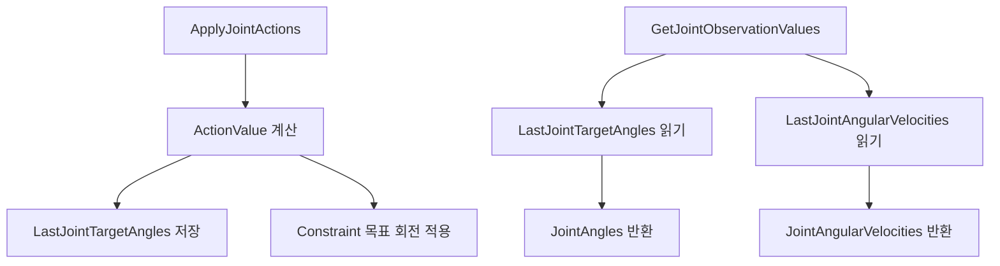

{}

{}


---


{}

{}

- 이제 `BP_SpiderInteractor`에서 아래 세 종류 값을 모을 것이다.

```text
1. Body Observation 9개
2. Joint Angles 배열
3. Joint Angular Velocities 배열
```


그 후, 여기에 `Target Direction` 2개를 추가하면 전체 Observation이 완성이 된다.

- BP_SpiderInteractor를 열면 노드가 깨진 상태인걸 확인할 수 있는데, 이는 C++ 재빌드를 수행해서 기존 노드가 깨진 것이다. 오른쪽 클릭을 해서 새로고침을 하자


- 이제는 BP_SpiderInteractor에서 **Gather Agent Observation **을 구현해야 한다. 즉 로봇 상태를 실제 Observation으로 넣는 단계라고 할 수 있다.

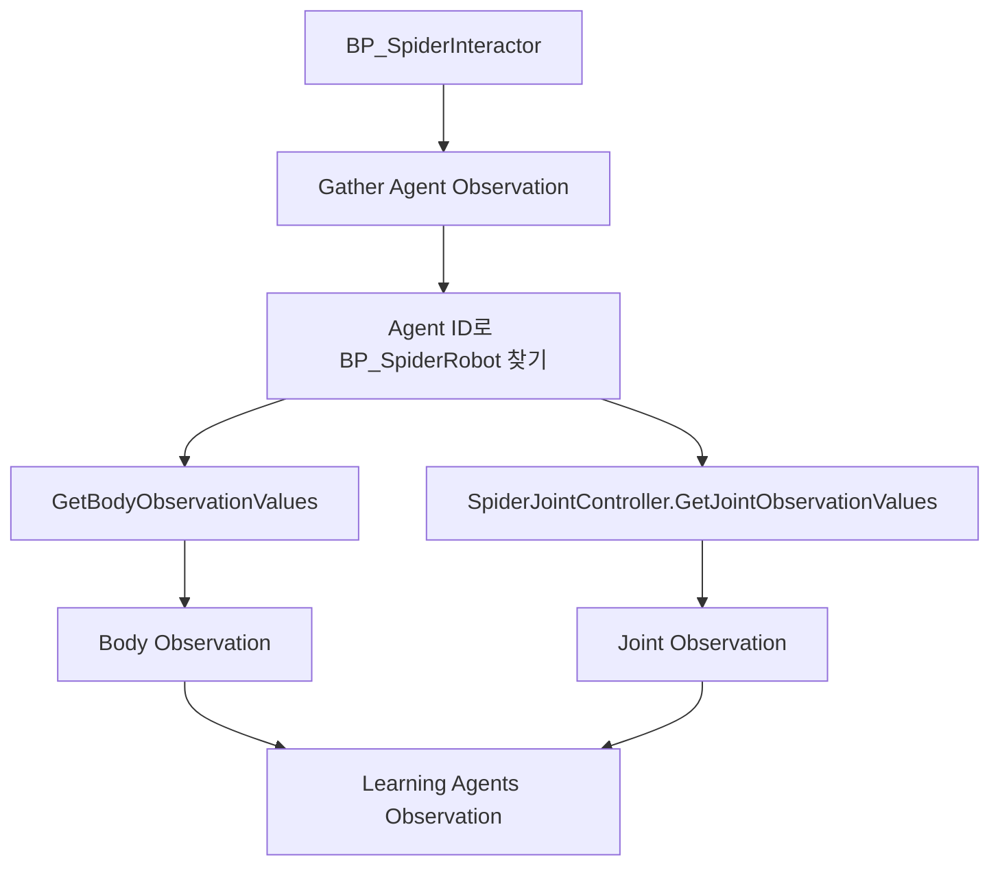

{}


{}

- 이 함수의 목적은 현재 Agent, 즉 `BP_SpiderRobot`의 상태를 읽어서 Policy가 볼 수 있는 Observation 값으로 채우는 것이다 .
- 강화학습 루프에는 크게 두 방향이 있는데 크게
1. 학습기 → 로봇

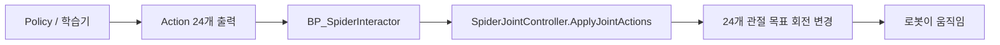

- 학습기가 이 관절을 이렇게 움직여라 명령을 내리고, 로봇이 명령대로 움직이는 역할
1. 로봇 → 학습기

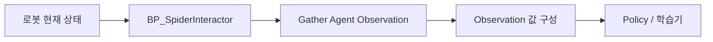

- 로봇이 지금 어떤 상태인지 학습기에게 알려주는 역할

이 있다. 1번 학습기 → 로봇 방향은 이미 Action 쪽에 구현을 완료했으니, 여기서부터는 반대 방향을 구성하면 된다.


- Gather Agent Observations/Agent Id → Get Agent 노드 연결
- Get Agent/Agent Class → BP_SpiderRobot
- 실제 로봇 객체를 등록했으니, 그 로봇의 몸체 상태를 읽어야 한다.
- 전에 만든 BP_SpierRobot 안에 만든 함수(GetBodyObservationValues)를 다시 보면, 이런 식으로 몸체 상태를 9개의 값으로 반환한다


```c++
odyRoll
BodyPitch
BodyYaw
BodyHeight
ForwardVelocity
RightVelocity
AngularVelocityX
AngularVelocityY
AngularVelocityZ
```


- 이 값들은 Policy가 로봇 상태를 이해하기 위한 기본 정보들로 정의했기 때문에 이 값을 Agent로 등록한 객체에게서 출력을 받아야 한다. 우리가 생성한 해당 함수로 몸체 상태를 출력하게 하
- `Get Agent`**/Return Value 출력핀 드래그 → **`Get Body Observation Values `노드 생성


- 여기까지 하면 이제 Agent에 해당하는 실제 로봇을 찾고, 그 로봇의 몸체 상태 9개를 읽는 데 성공한 것이다.

{}


{}

- Policy가 다음 Action을 잘 만들려면 몸체의 상태뿐만이 아니라, 현재 각 관절이 어떤 상태인지도 알아야 한다.

```text
앞다리가 이미 많이 접혀 있는가?
뒷다리가 펴져 있는가?
현재 Action이 어느 관절 목표값을 만들고 있는가?
```


그래서 `SpiderJointController`에서 관절 상태 배열을 읽어서 전달해야 한다.

- Get Agent/Return Value → Spider Joint Controller 노드 연결
- Spider Joint Controller →`Get Joint Observation Values` 호출


- 출력 확인 : Print String 2개 만들기
- 빈 공간 우클릭 → Print String을 2개 생성

```text
Print String 1 = Joint Angles 배열 길이 확인
Print String 2 = Joint Angular Velocities 배열 길이 확인
```

- Length 값을 Print String에 연결
- 실행선 연결

지금 `Gather Agent Observation`에서 바로 `Return Node`로 가는 흰색 실행선을


해당 형식으로 변경


```text
Gather Agent Observation 실행 핀
→ Get Body Observation Values 실행 핀
→ Print String 1
→ Print String 2
→ Return Node
```


 `Get Body Observation Values` 함수는 파란색 함수 노드라서 **실행선이 있어야 실제로 호출되는 함수**이기 때문이다.

- 최종 테스트 출력 형태


- BP가 또 초기화해서 관절 설정이 누락되었을 수도 있으니, BP_SpiderRobot→SpiderJointController의 디테일→SpiderJoint으로 가서, Joint Config Data 확인


{}


{}

- 지금까지 한작업이 Agent에서 값들을 가져오는 단계라면,

{}


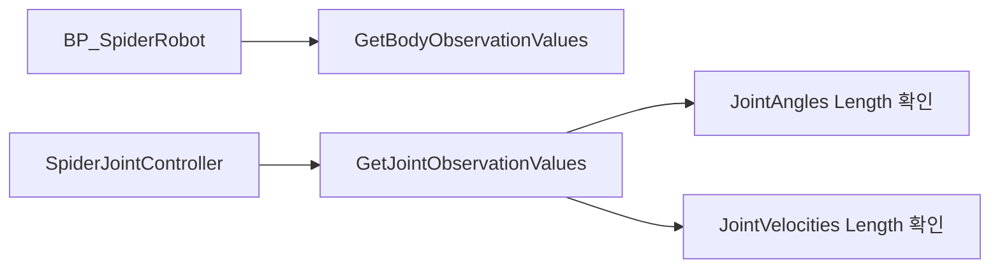


{}

- 이제는 읽은 값들을 **읽은 값을 실제 Learning Agents Observation Object에 넣는 작업**을 수행해야 한다

{}


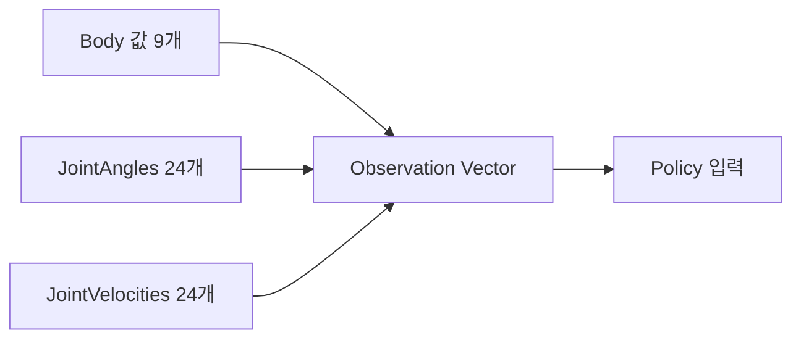


{}

- Learning Agents에서는 보통 Observation을 그냥 Gather에 막 넣는 게 아니라, 먼저 Observation 구조를 선언을 하고 다음에 실제 값을 채워넣으라고 명시되어 있다.
- 즉,
- `Specify Agent Observation`은 **그릇 만들기**
- `Gather Agent Observation`은 **그 그릇에 실제 값 담기**

로 구성을 해야한다.

- 빈 공간 우클릭 → 노드 추가(Specify Continuous Observation)
- 우리는


```c++
이 Agent는 매 스텝마다 Float 값 여러 개로 구성된 Observation을 받을 것이다.
그 개수는 현재 57개다.
```


이 Observation의 형태를 미리 선언을 해줘야 한다. 

- Specify Continuous Observation/Size = 57
- `Specify Agent Observation` 노드/In Observation Schema → Specify Continuous Observation /Schema 연결
- `Specify Continuous Observation`/Return Value → Return Node / Out Observation Schema Element 연결
- 완성 구조


- Gather Agent Observation에서 직접 Body 값과 Joint 값을 조립하지 않는다.
- BP_SpiderInteractor는 Learning Agents와 로봇을 연결하는 중계자 역할만 담당하고, 실제 Observation 배열 조립은 `BP_SpiderRobot`에서 수행하도록해야 Interactor 클래스의 역할이 분리가 된다

{}


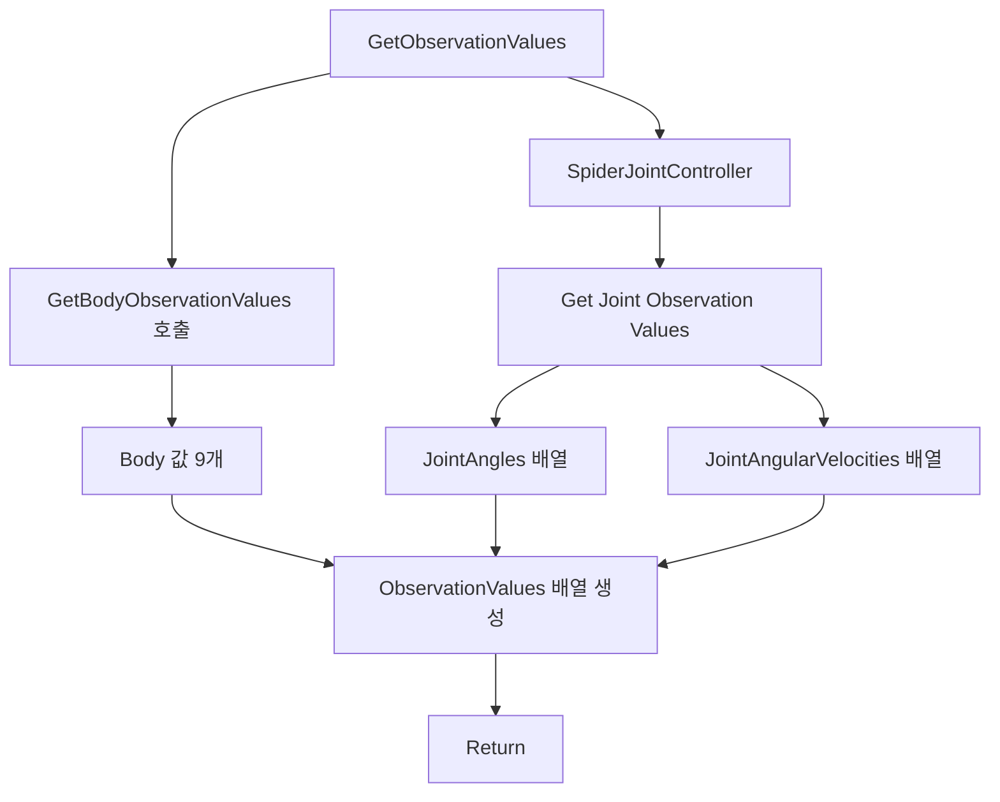


{}


{}

- 따라서 BP_SpiderRobot에 다음 함수를 추가해보자

```c++
GetObservationValues : Float Array
용도
Body Observation 9개
JointAngles 24개
JointAngularVelocities 24개
수집 후 하나의 배열로 반
```

- 출력 추가 (ObservationValues : Float Array)
- 기존 Body 함수 호출 (Get Body Observation Values)
- C++ 함수에서 만든 Spider Joint Controller/Get Joint Observation Values 함수 호출


{}


{}

- 빈 공간 우클릭 → Make Array 생성 →핀을 9개로 늘리고 아래 순서대로 연결

```text
[0] Body Roll
[1] Body Pitch
[2] Body Yaw
[3] Body Height
[4] Forward Velocity
[5] Right Velocity
[6] Angular Velocity X
[7] Angular Velocity Y
[8] Angular Velocity Z
```

- MakeArray/Array → Prompt to Local Value 선택 후, 로컬변수 이름 변경(BuiltObservationValues)


관절 24개를 하나하나 펼치지 않는 게 핵심이야.


---


## 2. Make Array 결과를 BuiltObservationValues에 Set


`BuiltObservationValues` 로컬 변수를 그래프로 드래그해서:


```text
Set BuiltObservationValues
```


선택.


그리고 연결:


```text
Make Array의 Array 출력
→ Set BuiltObservationValues의 배열 입력
```


실행선은:


```text
GetObservationValues 시작
→ GetBodyObservationValues
→ Set BuiltObservationValues
```


의미는 이거야.


```text
BuiltObservationValues = [BodyRoll, BodyPitch, BodyYaw, BodyHeight, ForwardVelocity, RightVelocity, AngularVelocityX, AngularVelocityY, AngularVelocityZ]
```


---


## 3. JointAngles 배열 붙이기


`BuiltObservationValues`를 Get으로 그래프에 꺼내.


그 배열 핀에서 드래그해서:


```text
Append Array
```


선택.


연결:


```text
Target Array = BuiltObservationValues
Source Array / New Items = Joint Angles
```


실행선:


```text
Set BuiltObservationValues
→ Append Array JointAngles
```


의미는:


```text
BuiltObservationValues 뒤에 JointAngles 배열 24개를 통째로 붙인다.
```


---


## 4. JointAngularVelocities 배열 붙이기


Append Array를 하나 더 만든다.


연결:


```text
Target Array = BuiltObservationValues
Source Array / New Items = Joint Angular Velocities
```


실행선:


```text
Append Array JointAngles
→ Append Array JointAngularVelocities
```


이제 배열 길이는:


```text
9 + 24 + 24 = 57
```


---


## 5. Return Node에 연결


마지막으로 `BuiltObservationValues`를 Get으로 꺼내서 Return Node의 출력에 연결해.


```text
BuiltObservationValues
→ Return Node.ObservationValues
```


실행선은 최종적으로:


```text
GetObservationValues
→ GetBodyObservationValues
→ Set BuiltObservationValues
→ Append Array JointAngles
→ Append Array JointAngularVelocities
→ Return Node
```


구조로 보면 이렇게야.


```text

```


먼저 `BuiltObservationValues` 로컬 변수 만들고, `Make Array`에 Body 9개 연결한 화면까지


{}


{}

- `Set BuiltObservationValues` 노드 오른쪽의 초록 격자 핀 또는 왼쪽 변수 목록의 `BuiltObservationValues`에서 드래그해서 **Get BuiltObservationValues**를 하나 꺼낸 후, 그 배열 핀에서 드래그해서 검색(Append Array) 후 노드 추가
- 두 번째 `Append Array`로 JointAngularVelocities 붙이기

---


## 최종 흐름


관절 24개를 하나하나 펼치지 않는 게 핵심이야.


---


## 2. Make Array 결과를 BuiltObservationValues에 Set


`BuiltObservationValues` 로컬 변수를 그래프로 드래그해서:


```text
Set BuiltObservationValues
```


선택.


그리고 연결:


```text
Make Array의 Array 출력
→ Set BuiltObservationValues의 배열 입력
```


실행선은:


```text
GetObservationValues 시작
→ GetBodyObservationValues
→ Set BuiltObservationValues
```


의미는 이거야.


```text
BuiltObservationValues = [BodyRoll, BodyPitch, BodyYaw, BodyHeight, ForwardVelocity, RightVelocity, AngularVelocityX, AngularVelocityY, AngularVelocityZ]
```


---


## 3. JointAngles 배열 붙이기


`BuiltObservationValues`를 Get으로 그래프에 꺼내.


그 배열 핀에서 드래그해서:


```text
Append Array
```


선택.


연결:


```text
Target Array = BuiltObservationValues
Source Array / New Items = Joint Angles
```


실행선:


```text
Set BuiltObservationValues
→ Append Array JointAngles
```


의미는:


```text
BuiltObservationValues 뒤에 JointAngles 배열 24개를 통째로 붙인다.
```


---


## 4. JointAngularVelocities 배열 붙이기


Append Array를 하나 더 만든다.


연결:


```text
Target Array = BuiltObservationValues
Source Array / New Items = Joint Angular Velocities
```


실행선:


```text
Append Array JointAngles
→ Append Array JointAngularVelocities
```


이제 배열 길이는:


```text
9 + 24 + 24 = 57
```


---


## 5. Return Node에 연결


마지막으로 `BuiltObservationValues`를 Get으로 꺼내서 Return Node의 출력에 연결해.


```text
BuiltObservationValues
→ Return Node.ObservationValues
```


실행선은 최종적으로:


```text
GetObservationValues
→ GetBodyObservationValues
→ Set BuiltObservationValues
→ Append Array JointAngles
→ Append Array JointAngularVelocities
→ Return Node
```


구조로 보면 이렇게야.


```text

```


먼저 `BuiltObservationValues` 로컬 변수 만들고, `Make Array`에 Body 9개 연결한 화면까지


{}


{}

- Return Node → 디테일 → 출력에서 플로트 / 배열 선택


- 2번째 Append 실행 핀 → Return Node, Get Build Observation Values → Return Node


{}

- 최종 구조


- 이제 실제로 로봇 블루포인트에 연결을 해서 테스트를 해보자
- BP)SpiderRobot으로 들어가서 이렇게 노드를 연결하고 컴파일 실행 후, 로그를 확인


```mermaid
LogAudioMixer: Deinitializing Audio Bus Subsystem for audio device with ID 10
LogAudioMixer: Display: FMixerPlatformXAudio2::StopAudioStream() called. InstanceID=10, StreamState=4
LogAudioMixer: Display: FMixerPlatformXAudio2::StopAudioStream() called. InstanceID=10, StreamState=2
LogUObjectHash: Compacting FUObjectHashTables data took   0.77ms
LogPlayLevel: Display: Destroying online subsystem :Context_16
```

- 정상적으로 Observation을 할 값들이 모두 출력된 걸 확인할 수 있다.

{}


{}

- 이제 BP_SpiderRobot에서 생성한 Observation 배열을 BP_SpiderInteractor가 받아서, Learning Agents의 Observation 객체에 실제 입력값으로 전달하는 단계이다.
- 즉, 지금까지 만든 몸체 상태, 관절 상태, 관절 각속도 값이 Policy가 입력으로 사용하는 Observation Vector가 되도록 연결하는 것이 주요 목표이다

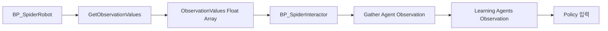


### Gather Agent Observation 수정

- 먼저 BP_SpiderInteractor 의  Gather Agent Observation 함수로 이동


- Get Agent/Return Value → Get Observation Values 노드 연결해서 로봇의 상태값을 꺼내도록 하자
- 실행 흐름을 Gather → Get Observation Values → Return 노드로 정리
- `Gather Agent Observation` 노드에 있는 파란 핀→`**Make Continuous Observation**`노드 생성()


- 이 노드는 새로운 연속 Observation을 만들어서 객체에서 받은 값(57개 배열)을 Learning Agent가 입력받는 Observation Element로 래핑해서 전달하는 역할을 수행한다.
- `Get Observation Values`의 배열 출력을 `Make Continuous Observation`에 연결해서 우리가 로봇에서 뽑은 float Array 값을 Continuous Observation 형식으로 감싼다


- `Make Continuous Observation/`Return Value → Return Node/Out Observation Object Element 연결
- 컴파일 후 실행 오류 체크
- 최종 구조

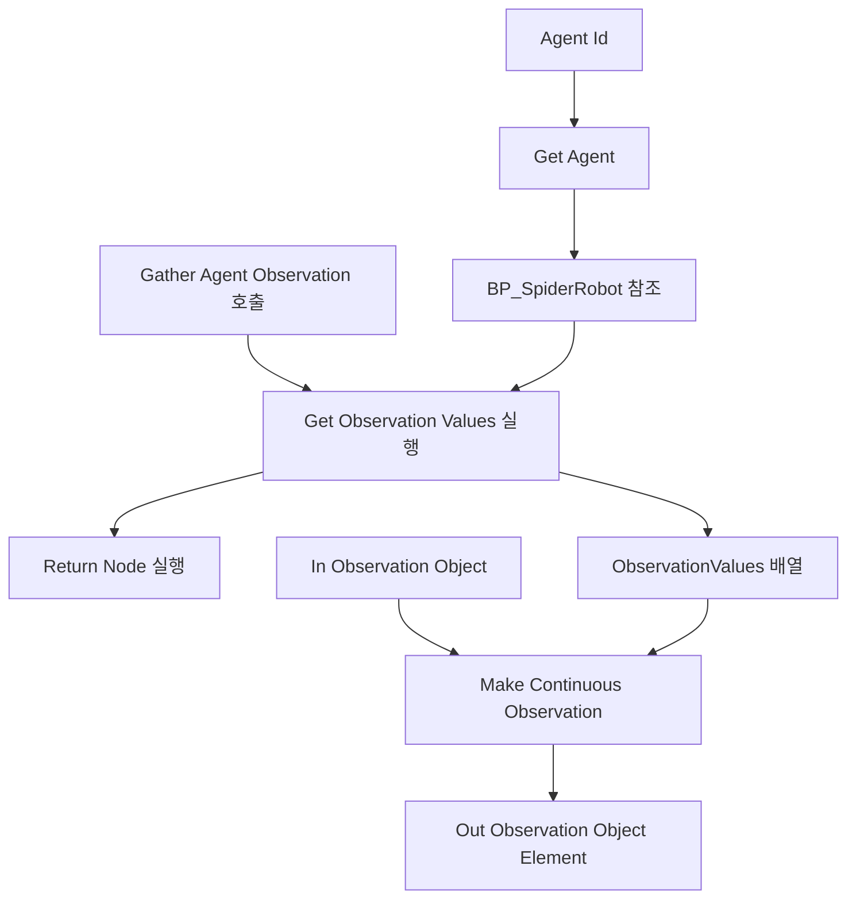


{}

{}


---

