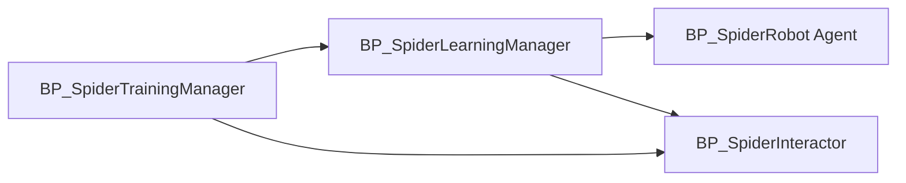
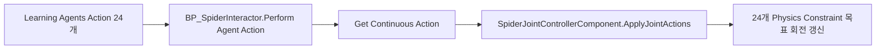
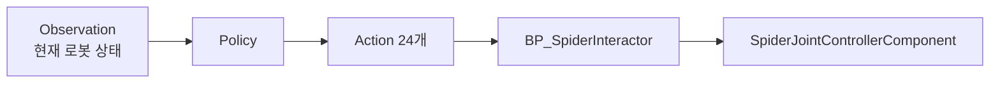
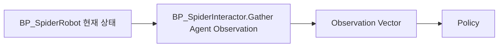
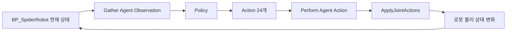
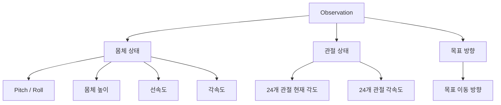
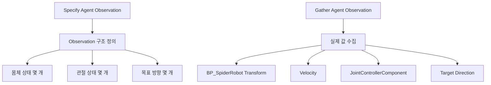
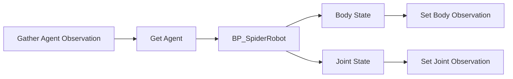




# 1. 소개

- 이전 단계에서는 BP_SpiderTrainingManager에서 `BP_SpiderInteractor를 생성하고, 이를 BP_SpiderLearningManager에 Listener로 등록한 뒤, BP_SpiderRobot을 Agent로 등록하는 구조까지 구성했다.

즉, 현재까지는 다음 흐름을 만들었다




- 또한 이전 작업에서는 학습기가 출력한 24개의 Continuous Action 값을 `BP_SpiderInteractor`에서 읽고, `SpiderJointControllerComponent.ApplyJointActions`로 전달하여 24개 Physics Constraint의 목표 회전을 갱신하는 구조도 구현했다



- 따라서 지금까지는 **학습기가 Action을 출력했을 때 그 Action을 로봇 관절에 전달하는 통로**를 만든 상태라고 볼 수 있다. 이번 단계에서는 반대로, 로봇의 현재 상태를 학습기가 읽을 수 있도록 **Observation 구조**를 설계해보
- 정리하면 이번 단계의 목표는 다음과 같다

```c++
1. 거미 로봇 학습에 필요한 상태 정보 정의
2. `BP_SpiderInteractor`에서 Observation 구조 설계
3. 이후 Policy가 사용할 입력 데이터의 기본 형태 준비
```


# 2. Observation이 필요한 이유

- 강화학습에서 Observation은 Agent가 현재 상황을 판단하기 위해 보는 입력 정보이다. 거미 로봇 학습에 대입하면 Observation은 다음 질문에 답하는 정보가 된다.

```text
현재 로봇 몸체가 얼마나 기울어져 있는가?

현재 로봇이 앞으로 움직이고 있는가?

각 관절은 어느 방향으로 얼마나 돌아가 있는가?

로봇이 목표 방향을 향하고 있는가

```

- 그러면 Policy는 이 Observation을 입력으로 받아 다음 Action을 출력한다.



- 즉, Observation이 부실하면 Policy는 현재 로봇이 넘어지고 있는지, 앞으로 가고 있는지, 관절이 어떤 상태인지 알 수 없다. 따라서 좋은 보행 학습을 위해서는 Action 출력 구조만큼이나 Observation 설계가 중요하다

# 3. 현재 학습 루프에서 Observation의 위치

- 이번 단계에서 추가할 Observation 흐름은 이 앞부분에 해당한다.



- 최종적으로는 아래와 같은 순환 구조가 된다.




즉, Observation은 학습 루프의 입력이고, Action은 학습 루프의 출력이다.


이번 단계에서는 이 중에서 몸체 상태, 관절 상태, 목표 방향을 1차 Observation 후보로 정의한다.


# 4. 거미 로봇에 필요한 상태 정보 분류

- 거미 로봇의 1차 학습 목표는 평지에서 쓰러지지 않고 앞으로 이동하는 것이다.

따라서 처음부터 모든 정보를 넣기보다, 보행에 직접 필요한 최소 상태 정보부터 구성한다.


초기 Observation은 크게 세 가지(몸체 상태 / 관절 상태 / 목표 방향)로 나눌 수 있다.





# 5. 1차 Observation 구성안

- 초기 Observation은 너무 복잡하게 구성하지 않고, 평지 보행에 필요한 최소 상태를 중심으로 설계해보자

| 분류    | Observation                | 의미                             |
| ----- | -------------------------- | ------------------------------ |
| 몸체 상태 | Body Pitch                 | 몸체가 앞뒤로 얼마나 기울었는지              |
| 몸체 상태 | Body Roll                  | 몸체가 좌우로 얼마나 기울었는지              |
| 몸체 상태 | Body Height                | 몸체가 바닥에서 얼마나 떠 있는지             |
| 몸체 상태 | Forward Velocity           | 로봇이 전방으로 움직이는 속도               |
| 몸체 상태 | Right Velocity             | 로봇이 좌우로 밀리는 속도                 |
| 몸체 상태 | Angular Velocity           | 몸체가 회전하거나 흔들리는 정도              |
| 관절 상태 | Joint Angle 24개            | 각 Physics Constraint의 현재 회전 상태 |
| 관절 상태 | Joint Angular Velocity 24개 | 각 관절이 얼마나 빠르게 움직이는지            |
| 목표 정보 | Target Direction           | 로봇이 이동해야 하는 방향                 |


처음부터 완벽한 보행을 만들기 위한 것이 아니라, Policy가 최소한 다음 정보를 알 수 있게 만드는 것이 목적이다.


```text
내 몸이 기울어졌는가?
내가 앞으로 가고 있는가?
관절들이 현재 어떤 자세인가?
다음 Action을 어느 방향으로 조정해야 하는가?
```


#  6. BP_SpiderInteractor에서 구현할 내용 정리

- Learning Agents에서 Observation은 주로 BP_SpiderInteractor의 두 함수에서 다룬다.

| 함수                          | 역할                                  |
| --------------------------- | ----------------------------------- |
| `Specify Agent Observation` | Observation의 형태와 크기를 정의             |
| `Gather Agent Observation`  | 실제 Agent 상태를 읽어서 Observation 값으로 채움 |





{}

- Specify Agent Observation은 학습기가 받을 Observation의 구조를 정의하는 단계이다.

즉, 이 함수에서는 실제 값을 넣는 것이 아니라, 앞으로 어떤 형태의 Observation을 사용할지 선언한다.

- 현재 계획하는 1차 Observation 구조는 다음과 같다.

```c++
Body State

- Pitch
- Roll
- Height
- Forward Velocity
- Right Velocity
- Angular Velocity

Joint State

- Joint Angle 24개
- Joint Angular Velocity 24개

Command State

- Target Direction
```

{}


{}

- Gather Agent Observation은 실제 학습 루프 중 매 스텝마다 호출되어, Agent의 현재 상태를 Observation 값으로 채우는 함수이다.

이 함수 안에서는 Agent ID를 기준으로 실제 `BP_SpiderRobot`을 가져온 뒤, 필요한 상태 정보를 읽는다.




- 이 단계에서 중요한 점은 `Perform Agent Action`과 마찬가지로, `Gather Agent Observation`도 Agent ID를 기준으로 실제 `BP_SpiderRobot`을 찾아야 한다는 점이다.

따라서 이전 단계에서 `BP_SpiderInteractor`를 `BP_SpiderLearningManager`에 Listener로 등록한 것이 필요하다.

{}


# 7. 후기


 이번 장에서는 Observation에 어떤 정보를 포함할지 설계해보았다. 다음 장에서는 이 설계를 바탕으로 `BP_SpiderInteractor`의 `Specify Agent Observation`과 `Gather Agent Observation` 블루프린트 구현을 진행해보자

